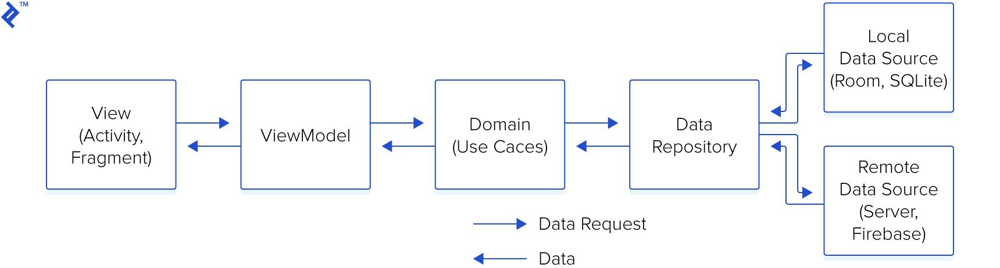

## A simple Android-App template that lets you create an Android/Kotlin project and be up and running in a few seconds.

## Built With 🛠
- [Kotlin](https://kotlinlang.org/) - First class and official programming language for Android development.
- [Coroutines](https://kotlinlang.org/docs/reference/coroutines-overview.html) - For asynchronous and more..
- [Android Architecture Components](https://developer.android.com/topic/libraries/architecture) - Collection of libraries that help you design robust, testable, and maintainable apps.
    - [Flows](https://developer.android.com/kotlin/flow) - A flow is a type that can emit multiple values sequentially, as opposed to suspend functions that return only a single value.
    - [ViewModel](https://developer.android.com/topic/libraries/architecture/viewmodel) - Stores UI-related data that isn't destroyed on UI changes.
    - [Jetpack Navigation](https://developer.android.com/guide/navigation) - Navigation refers to the interactions that allow users to navigate across, into, and back out from the different pieces of content within your app
    - [Hilt](https://developer.android.com/training/dependency-injection/hilt-android) - Hilt is a dependency injection library for Android that reduces the boilerplate of doing manual dependency injection in your project.
    - [Retrofit](https://square.github.io/retrofit/) - Is type-safe REST client for Android which aims to make it easier to consume RESTful web services.
    - [Glide](https://bumptech.github.io/glide/) - An image loading and caching library for Android.
 

## Architecture 🗼
This app uses [***Clean Architecture***](https://developer.android.com/topic/architecture) With [***MVVM (Model View View-Model)***](https://developer.android.com/jetpack/docs/guide#recommended-app-arch) architecture.

